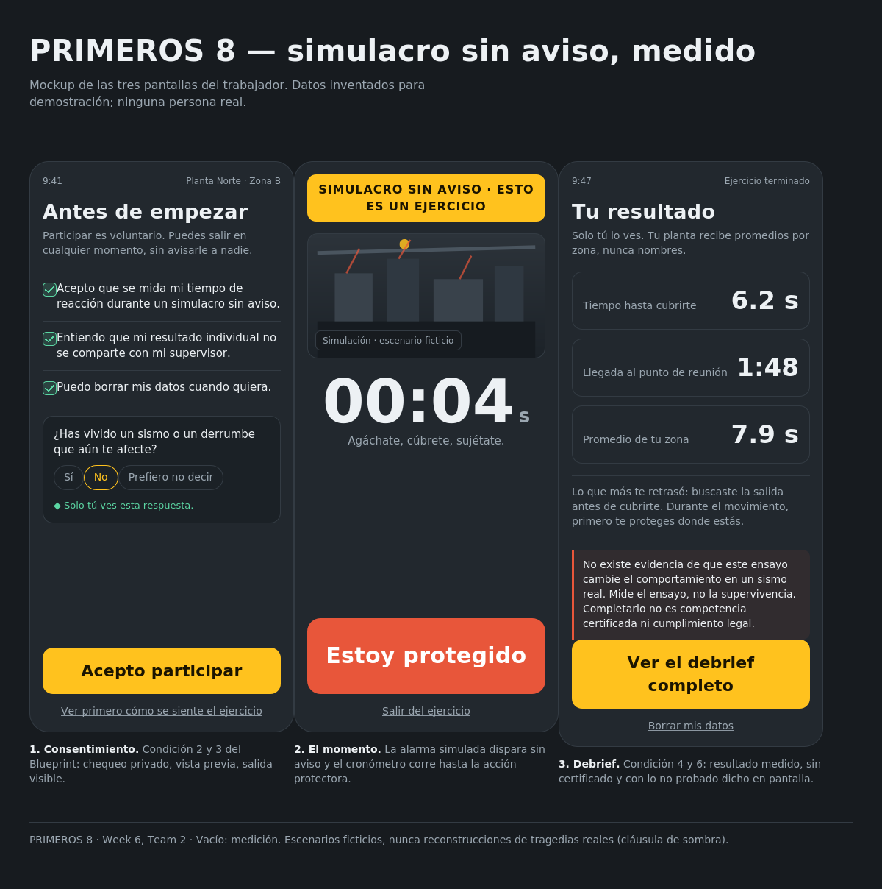
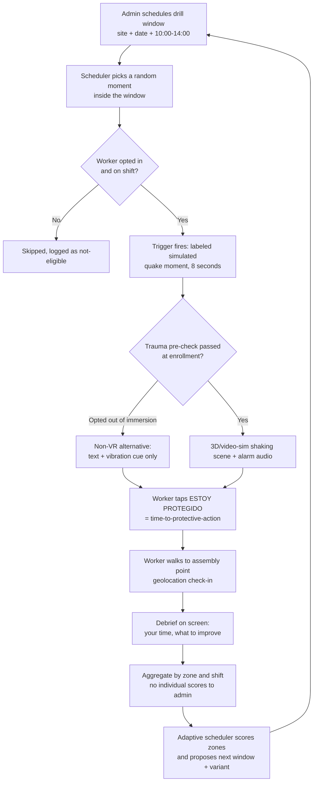
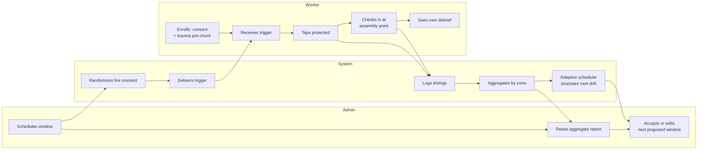

# PACKET — Week 6 · Business Bending
**Fatima Fortes Ortega · Team 2 · Adversary · Vacuum: Measurement**

Working name: **PRIMEROS 8** (the first eight seconds)

---

## 1. The problem, in my words

Mexican plants run the drills the law requires, and they record that the drill happened: a date, a list of names, an evacuation time. Nobody records what each person did in the first seconds, while the ground is still moving, before anyone walks to the assembly point. The drill is announced, so people rehearse a walk they already know is coming. My own research killed the idea that a headset fixes this: what is missing is not immersion, it is a surprise trigger and a measurement of the protective action itself.

## 2. The exact user

**Primary user (buyer and admin):** the EHS / civil-protection coordinator of a multinational plant in Mexico, who already reports safety metrics to a foreign parent company and already owns a mustering or headcount tool. She needs a number her parent company will accept, not a certificate.

**Secondary user (the measured one):** a plant worker on shift, phone in pocket, who receives an unannounced alarm and has to act. He is not the buyer, he is the person whose consent has to be real and whose individual score never reaches his boss.

## 3. Success definition

**Before the module closes:** an admin can schedule an unannounced drill window for a site; the system fires at a random moment inside that window; a worker's phone plays a short labeled simulated quake moment; the app measures time-to-protective-action and time-to-assembly-point; and the admin sees an aggregate-only result per zone, plus an adaptive recommendation for the next drill window. Live URL, real data in Supabase, no individual score visible to the admin.

## 4. Mockup

Three worker screens, left to right: enrollment with a private trauma pre-check and a visible exit; the unannounced drill moment with the labeled simulation, the running timer and the single large action; the debrief with the measured result, the aggregate-only note and the unverified-claims warning. Data shown is invented. The admin dashboard is the fourth screen and is not mocked here; it shows zone aggregates only, never names.

## 5. The flow

## 6. Benchmark line

**The best existing solution on Earth for this is** enterprise safety-training and mustering software: Strivr's VR modules (about 17,000 headsets across Walmart's US stores, measured on test scores) and digital mustering tools that time evacuations and keep a drill audit trail.

**Mine differs or localizes by** measuring the protective action in the first seconds under an unannounced trigger instead of counting attendance at the assembly point, and by being built for the Mexican Programa Interno context, where the standard pays for hours and topics and nobody is required to prove behavior.

## 7. Long view (3 years)

If this slice works, the product becomes the measurement layer for emergency rehearsal in Mexico: a library of unannounced, physically plausible scenarios plus a per-zone behavior index that a plant can show its parent company and, eventually, its insurer. The headset is optional throughout; what is sold is the number, not the immersion. The honest ceiling is that nobody has yet shown any rehearsal format changes real-quake behavior, so the company's real job is to produce the first dataset that could answer that question, not to claim the answer.

## 8. Scope cut — what I am NOT building

- No headset build. The simulated moment runs in the browser; a WebXR path is future work.
- No real integration with any mustering vendor. The assembly-point check-in is mine, not theirs.
- No native app, no push notifications through Apple or Google. The worker device stays on a PWA/tab during the demo, which I state as a limitation.
- No real plant, no real workers, no real personal data. Seeded, invented data only, labeled.
- No individual leaderboard, no biometric, facial or emotional capture. Ever.
- No claim that the measured time predicts survival.
- Pre-committed cut if the 3D scene threatens the deadline: drop Three.js/WebXR entirely and ship the labeled video-sim/CSS-shake fallback the stack floor already allows. Decided now, not renegotiated under deadline pressure.
- Pre-committed fallback if Google OAuth setup stalls past commit 3: Supabase magic-link email auth. Flagged, not silent — WEEK6's security floor names Google sign-in specifically, so this swap needs my own sign-off before use, not an automatic substitution.

## 9. Architecture + stack

| Layer | Choice | Why |
|---|---|---|
| App | Next.js (App Router) on Vercel | Free tier, one deploy per push |
| Data | Supabase Postgres | Free tier, RLS built in |
| Auth | Supabase Auth, Sign in with Google | Admin and worker roles, no passwords to store |
| Simulation | Three.js scene (fallback: labeled video-sim) + Web Audio alarm | Stack floor: simulation, labeled on screen |
| Signal 2 (adaptive) | Scheduler scoring zones/shifts by protective-action time AND assembly-point geodata (time-to-assembly, verified check-in), grouped by each worker's already-assigned zone/shift, choosing the next window, the next scenario variant, and which zone/shift it targets | Stack floor: adaptive logic, real not faked |
| Signal 3 (geodata) | Browser Geolocation for assembly-point check-in only — coarse zone estimate, verified flag, time-to-assembly. No live location capture at the trigger moment: zone attribution for scoring comes from the worker's assigned zone, not a second GPS read, so nothing here tracks a worker's live position during a shift (Blueprint condition 3). | Stack floor: third signal, wired into the scheduler, not a bystander |
| Realtime | Supabase Realtime | Delivers the trigger without push infrastructure |

**A real chain, not just a stack:** simulation fires the measurement (time-to-protective-action) → that measurement plus assembly-point geodata (time-to-assembly, verified check-in) feed the adaptive scheduler, grouped by each worker's assigned zone and shift → the scheduler chooses the next scenario variant, the next window, and who it targets. Removing the simulation still only breaks stack-floor compliance, not the timer — the tap event doesn't need a 3D scene to fire. Geodata here is not a live trigger-time location read — that would be worker tracking, which Condition 3 rules out — it's the assembly-point check-in plus a zone the worker was already assigned to. Without it the scheduler knows only response time, not how long the walk took or which zone a slow result belongs to, so it can't target correctly. That coupling is real without adding any tracking beyond decision, action and timing data.

## 10. Blueprint conditions → where they live in the product

| Condition | Implementation |
|---|---|
| 1. Shadow clause | Scenarios are invented plants and invented events. No 19S, no real building, no real victim. Visible behavior: the on-screen label "Simulación · escenario ficticio" on the trigger screen (in the mockup). No scenario-picker screen exists in this build — the claim is anchored to that label, not to an unbuilt picker. |
| 2. Trauma pre-check, exit, non-VR path | Enrollment asks privately about prior quake or collapse experience; intensity preview before first drill; "Salir del ejercicio" visible on every screen; text+vibration path presented as equal, not lesser. Acceptance criterion: the non-immersive path runs the same protective-action timer, produces the same scored fields, and uses the same debrief wording as the 3D/video-sim path — nothing in copy or UI marks it as a lite or fallback version. |
| 3. No biometric / aggregate only | Only decision, action and timing data. Admin views are aggregate by zone and shift, minimum 5 responses to display. Worker can delete his own data; retention 90 days. |
| 4. Completion ≠ competence | No certificates. Every result screen says the measured number is a rehearsal result, not certified competence or legal compliance. This slice shows a single session's result and the zone average only — it makes no improvement or trend claim, so Condition 4's before-any-improvement-claim gate has nothing to trigger yet. The gate becomes a real feature requirement only if a future slice adds trend/comparison claims. |
| 5. Financing | Out of scope for the slice, stated in the packet and in the demo: first proof phase is institutional or insurer funded, never worker or school paid. |
| 6. Unverified claims stated on screen | Persistent footer, required on all three worker screens — enrollment, trigger moment, and debrief, not just the result screen. Acceptance criterion for feature 5: the one-line disclaimer renders on every worker screen; mockup updated to match. Text: "No hay evidencia de que este entrenamiento cambie el comportamiento en un sismo real. Esto mide el ensayo, no la supervivencia." |

## 11. Security floor

- [ ] No keys in the repo; Supabase and any API keys in Vercel environment variables only.
- [ ] Supabase Auth (Google) required for both roles; nothing personal behind an open door.
- [ ] RLS on every table: a worker reads only his own rows; an admin reads only his site's aggregates.
- [ ] Every form validated: length caps, type checks, enum checks on role and zone.
- [ ] Seed data is invented and labeled; no real names, no real plant.

## 12. Test plan

**Mechanical pass**
1. Admin schedules a window in the past → rejected with a clear message.
2. Trigger fires inside the window, never outside it (run with a 2-minute window).
3. Worker who opted out of immersion gets the text path, never the 3D scene.
4. Time-to-protective-action recorded to the millisecond; check one entry by hand against the log.
5. Geolocation denied → check-in still possible manually, flagged as unverified.
6. Admin view with fewer than 5 responses → shows "insufficient data", not individual rows.
7. RLS: log in as worker B, try to read worker A's row by id → denied.
8. Footer disclaimer visible on all three worker screens — enrollment, trigger moment, and debrief — checked individually against the updated mockup, not assumed from the debrief screen alone.
9. Shadow clause: the "Simulación · escenario ficticio" label appears on the trigger screen before/during the shaking moment, for every scenario variant, no exceptions.
10. RLS: logged in as admin, `select * from p8_enrollments` returns nothing — no policy grants admin access to the trauma pre-check, not even scoped to their own site.

**Persona test (Layer 1)**
Synthetic user: *"Eres Don Chuy, 41, operario de línea en una planta en Querétaro. Traes guantes y tapones para los oídos. Tienes el celular en el bolsillo del pantalón. Usas WhatsApp y Facebook, casi ninguna otra app. Desconfías de que la empresa te vigile. Lees rápido pero no lees lo que parece contrato. Si algo te confunde, guardas el teléfono y sigues trabajando."*
Walk him through: consent screen → trigger → protective action → check-in → debrief. Log every hesitation. Fix the worst one, redeploy, document in PERSONA_fatima.pdf.

## 13. Commit plan

1. Scaffold Next.js + Supabase client, env vars, empty schema.
2. Schema + RLS policies + seeded invented data.
3. Admin: schedule window, list drills.
4. Worker: enrollment with consent and trauma pre-check, realtime trigger.
5. Simulated quake moment + protective-action timer + non-VR path.
6. Geolocation check-in + debrief screen with disclaimers.
7. Aggregate dashboard with 5-response minimum.
8. Adaptive scheduler proposing the next window.
9. Bug fix from the mechanical pass + redeploy.
10. Fix from the persona test + redeploy.

Two deploys minimum; I plan four.
